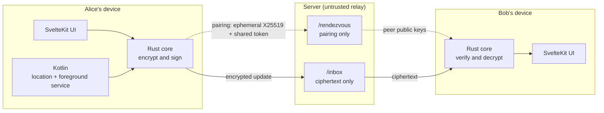

# Locatorr

[](https://github.com/ClemPera/Locatorr/actions/workflows/ci.yml)

End-to-end encrypted location sharing for Android and desktop: your contacts can see where you are, and the server that carries the updates cannot.

> [!WARNING]
> **Proof of concept, unaudited.** This code has not been reviewed or audited, and it is not production-ready. Do not rely on it as the only thing protecting anyone whose safety depends on their location. Only the latest commit on `main` is maintained; there are no supported releases.

## What it is

Sharing your location usually means handing it to a platform. Locatorr pairs the two devices directly instead: an update is encrypted and signed on the sender's device and only decrypted on the recipient's. The server in the middle is a store-and-forward relay that only ever holds ciphertext, and you run it, so it does not need to be trusted.

Because sharing is asynchronous, the design uses an ephemeral-static hybrid scheme rather than a full double ratchet.

## What it protects, and what it does not

**Protects**

- Location payloads and content keys: the relay stores and returns ciphertext it cannot read.
- Authenticity: each update is signed with the sender's ML-DSA-65 key over the sender id, a monotonic sequence number, the ephemeral key and the wrapped key, and the recipient verifies before decrypting.
- Replay: a durable per-sender sequence counter and replay guard reject replayed or reordered updates.
- Post-quantum confidentiality: the content key is wrapped under ML-KEM-768 **and** X25519, so recorded traffic is not exposed by a future quantum break alone.

**Does not protect**

- **Metadata.** The relay necessarily sees device ids, the timing and size of every update, and your IP addresses. It does not see where anyone is.
- **A compromised device or OS.** Keys live on the device; the app is only as strong as the endpoint.
- **Recorded traffic versus recipient keys.** If the recipient's static private keys are later compromised, previously recorded updates can be decrypted. This is a deliberate trade-off of asynchronous store-and-forward without prekeys, and it is written up in `doc/phases.md`.
- **A stable identity check.** The pairing fingerprint is derived from the per-session encrypted bundles rather than the public keys themselves, so it is a one-time comparison, not a value you can recognise again later.

## Quickstart

```sh
# Server: needs Postgres and a server/.env (copy server/.env.example)
cd server && go run .

# Client, desktop
cd client && npm ci && npm run tauri dev

# Client, Android (debug; cleartext HTTP to a local server only works in debug builds)
cd client && npx tauri android build --debug -t aarch64
```

The client and the server are configured with the server URL in the app's Pair and Live screens; a phone testing against a machine on your LAN needs that machine's address, not `localhost`.

Full build, test and release matrix: [`AGENTS.md`](AGENTS.md) (and `.github/workflows/`).

## Architecture

A Tauri v2 app with a SvelteKit frontend and a Rust core does the cryptography and the HTTP. On Android, a Kotlin plugin and a foreground service keep location updates flowing while the app is backgrounded, behind a persistent notification. The server is a small Go/Gin service over Postgres that performs no cryptography at all.



Alice's app encrypts and signs an update and posts it to Bob's inbox; Bob's app fetches it, verifies the signature and decrypts it. The server only relays.

## Documentation

- [`doc/phases.md`](doc/phases.md) — the cryptographic design and the step-by-step protocol.
- [`doc/roadmap.md`](doc/roadmap.md) — phased plan and acceptance checklist, including what is verified and what is still assumed.
- [`doc/protocol_diagram.html`](doc/protocol_diagram.html) — interactive protocol diagram.
- [`AGENTS.md`](AGENTS.md) — build and verification details, plus the traps worth knowing before changing the Android bridge.

## Status

Phases 0 through 3 are implemented: pairing, sending, receiving, an offline map, and Android background sharing. The Rust core, the frontend and the Android bridge are covered by tests and by CI, and a debug APK builds. It has **not** been exercised on a physical device yet, so the runtime assumptions around background lifecycle are recorded rather than proven — see the verification note in [`doc/roadmap.md`](doc/roadmap.md).

## Security

No audit has been performed and there is no `SECURITY.md` yet. Report anything sensitive through GitHub's private vulnerability reporting on this repository rather than a public issue.

## Contributing

Issues and pull requests are welcome. CI gates on the Rust, frontend and Go suites; run the same checks locally before opening a PR — the commands are listed in [`AGENTS.md`](AGENTS.md). Newcomers should start with the architecture diagram above and `doc/phases.md`.

## License

[AGPL-3.0](LICENSE). If you run a modified version as a network service, the license requires you to offer the corresponding source to its users.
